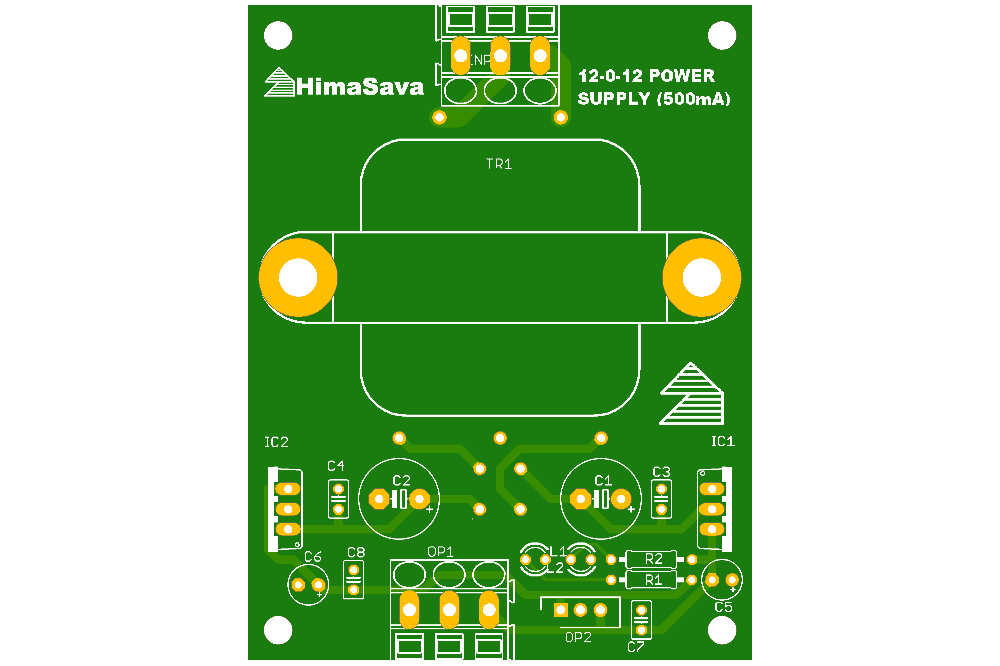
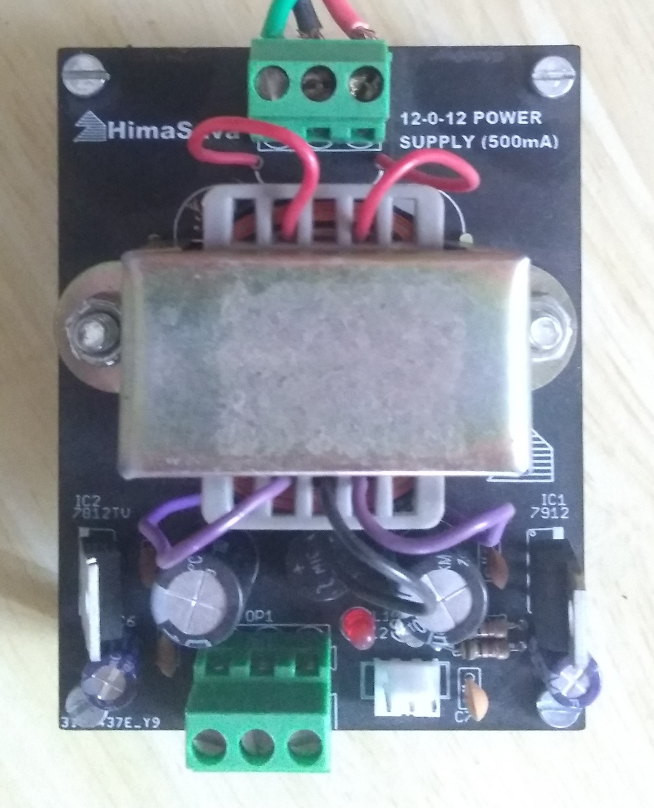

# 12V_Power_Supply

A simple AC-DC 12V Power Supply.

Needed a +12V and -12V power supply for my ECG project. Didnt find a cheap alternative and I didn't want be relient only on benchtop power supplies. So made one.

ECG Project:
https://github.com/HimaSava/Single_Lead_ECG_Machine

It is a simple 2-Layer board with a 220V to 15V (500mA) centre tapped transformer. A bridge rectifier followed by a few capacitors and 7812 & 7912 voltage regulators. 

Note: Dont use a 12V transformer. There is some voltage drop in the voltage rectifiers. With a 12V transformer the output voltage is 11.75V without load. Also there is no need for heat sinks as the regulators dont get very hot due to the low current.

PCB Layout:

Assembled Circuit:

